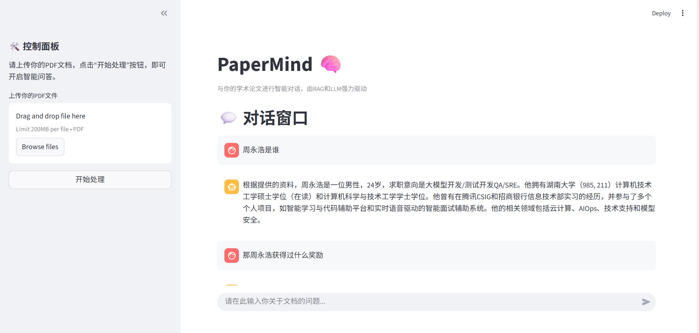

# PaperMind: 你的AI科研论文阅读与分析助手 🚀

[](https://www.python.org/)
[](https://streamlit.io/)
[](https://ai.google.dev/)
[](https://opensource.org/licenses/MIT)

**PaperMind** 是一个基于检索增强生成（RAG）技术的智能应用，旨在解决科研工作者、学生和工程师在处理海量学术论文时面临的信息过载和阅读效率低下的核心痛点。

通过本工具，你可以与单篇或多篇论文进行深度对话，快速提取核心信息、对比不同研究的异同，并以前所未有的效率完成文献综述（Literature Review）工作。

### 🎬 应用演示



---

### ✨ 核心功能

* **📝 单篇论文深度问答**: 上传一篇PDF论文，即可就其内容进行自由提问，例如“这篇论文的核心贡献是什么？”或“请解释一下文中的XX算法”。
* **📚 动态知识库构建**: 上传文档后，系统会即时为其创建专属的向量知识库，作为AI回答问题的唯一信息来源。
* **🧠 RAG驱动的精准回答**: 所有回答均基于你上传的文档内容生成，有效避免了通用大模型的时效性问题和信息幻觉。
* **🔍 答案来源可追溯**: RAG架构确保了答案的依据来源于文档本身，增强了结果的可信度。

---

### 🎯 项目动机

作为一名研究生，我深刻体会到科研工作的挑战性。每周都需要阅读大量的前沿论文，但传统阅读方式耗时巨大，且读过的知识点容易遗忘、难以串联。通用的大语言模型（LLM）因其训练数据的时效性问题，无法对最新的研究成果进行分析。

为了解决这一痛点，我决定利用RAG技术，打造一个真正能为科研工作提效的AI助手，将研究者从繁琐的“信息搬运”中解放出来，更专注于“创新思考”。

---

### 🛠️ 技术栈

| 分类              | 技术 / 模型                                          |
|:--------------- |:------------------------------------------------ |
| **前端**          | `Streamlit`                                      |
| **AI / RAG 核心** | `LangChain`, `Google Gemini (gemini-1.0-pro)`    |
| **嵌入模型**        | `Sentence-Transformers (BAAI/bge-large-zh-v1.5)` |
| **向量数据库**       | `FAISS`                                       |
| **数据处理**        | `PyMuPDF`                                        |

### 🏗️ 系统架构

本项目采用模块化的设计，将UI层 (`app.py`) 与核心RAG逻辑 (`core/`) 分离，保证了代码的清晰度和可扩展性。

*(可选：在这里可以放一张系统架构图)*

---

### ⚙️ 安装与运行

#### 1. 克隆项目

```bash
git clone https://github.com/YOUR_USERNAME/PaperMind.git
cd PaperMind
```

#### 2. 创建并激活虚拟环境

```bash
# 对于 macOS/Linux
python3 -m venv venv
source venv/bin/activate

# 对于 Windows
python -m venv venv
.\venv\Scripts\activate
```

#### 3. 安装依赖

```bash
pip install -r requirements.txt
```

#### 4. 配置环境变量

在项目的**根目录**下创建一个名为 `.env` 的文件，并填入你的Google AI API密钥。

> 你可以从 [Google AI Studio](https://aistudio.google.com/) 获取免费的API密钥。

**文件 `.env` 的内容应如下:**

```env
GOOGLE_API_KEY="AIzaSyXXXXXXXXXXXXXXXXXXXXXXX"
```

#### 5. 配置网络代理 (重要)

Google的服务在部分地区可能需要通过网络代理访问。请打开 `core/chain.py` 文件，找到以下代码行，并**修改为你自己的代理地址和端口**。

```python
# PaperMind/core/chain.py
# --- 网络代理设置 ---
PROXY_URL = "http://127.0.0.1:7890"  # ‼️ 修改成你自己的代理地址！
```

> 如果你不需要代理，可以将此行注释掉或将 `PROXY_URL` 设置为 `None`。

#### 6. 运行应用

确保你的代理软件（如果需要）正在运行，然后在终端中执行：

```bash
streamlit run app.py
```

应用启动后，在浏览器中访问 `http://localhost:8501` 即可开始使用！

---

### 🚀 未来规划 (Roadmap)

- [ ] **优化UI/UX**: 提升交互体验，增加会话历史记录的可视化管理。
- [ ] **增强PDF解析**: 优化对论文中**表格、图片和公式**的识别与提取能力。
- [ ] **知识图谱可视化**: 提取论文中的关键实体（如模型、数据集），并以图谱形式展示它们之间的关联。
- [ ] **集成Zotero/Mendeley**: 与主流文献管理工具打通，直接读取文献库。
- [ ] **部署上线**: 将应用部署到云平台，方便随时随地访问。

---

### 📜 开源许可

本项目采用 [MIT License](LICENSE) 开源。